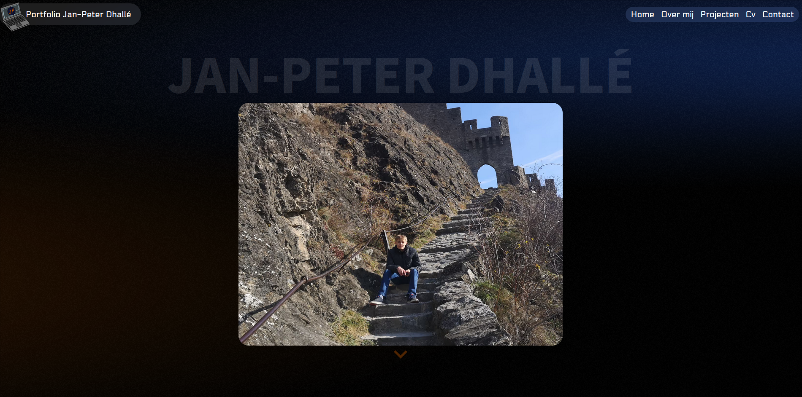

# Portfolio Jan-Peter Dhallé
> This app is deployed to Vercel



## Generate CV PDF

You can generate a PDF version from the /cv page using `puppeteer` and `nodejs`.

```bash
pnpm run pdf
```

## Developing

Once you've created a project and installed dependencies with `pnpm install`, start a development server:

```bash
pnpm run dev

# or start the server and open the app in a new browser tab
pnpm run dev -- --open
```

## Building

To create a production version of your app:

```bash
pnpm run build
```

You can preview the production build with `npm run preview`.

> To deploy your app, you may need to install an [adapter](https://kit.svelte.dev/docs/adapters) for your target environment.
